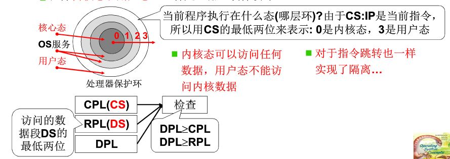
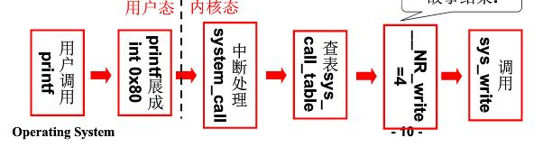

#系统调用 
##操作系统接口 
**POSIX ：Portable Operating System Interface of Unix  (IEEE 制定的一个标准族)**  
POSIX是一个Unix的操作系统接口标准  
任务管理： fork(创建一个进程)   execl(运行一个可执行程序)   pthread_create(创建一个线程)   
文件系统：open(打开一个文件或目录)  EACCES(返回值，表示没有权限)  mode_t st_mode(文件头结构：文件属性)  
    
##系统接口调用  
-  1、不能跳转  
都在内存中的代码，用户程序代码不能任意的跳转到内核代码所在的内存区域，也不能读取内核所在内存区的数据。  
    
    
-  2、为什么不能跳转
将内核程序和用户程序隔离！！！  
区分**内核态和用户态**：一种处理器“硬件设计”  
  
**DPL**：是当前执行的程序或任务的特权级。它被存储在CS和SS的第0位和第1位上。通常情况下，CPL等于代码的段的特权级。在遇到一致代码段时，一致代码段可以被相同或者更低特权级的代码访问。当处理器访问一个与CPL特权级不同的一致代码段时，CPL不会被改变。  
**CPL**：DPL表示段或者门的特权级，它被存储在段描述符或者门描述符的DPL字段中。当当前代码段试图访问一个段或者门时，DPL将会和CPL以及段或门选择子的RPL相比较，根据段或者门类型的不同，DPL将会被区别对待，下面介绍一下各种类型的段或者门的情况。  
**RPL**：RPL是通过选择子的第0位和第1位表现出来的。处理器通过检查RPL和CPL来确认一个访问请求是否合法。
  
  
-  3、怎么跳转  
**对于Intel x86，那就是中断指令int**  
1、int指令将使CS中的CPL改成0,"进入内核"  
2、这是用户程序发起的调用内核代码的唯一方式  
3、系统调用的核心  
**用户程序**中包含一段**int指令**的代码  
**操作系统**写**中断处理**，获取想调程序的编号
**操作系统**根据编号**执行相应代码**  
  
##系统调用的实现  
系统调用需要用到**int 0x80**中断 涉及到内嵌汇编[GCC内联汇编](https://www.ibm.com/developerworks/cn/linux/l-assembly/index.html)  
  
-  1、**int 0x80**：`_syscall3(type,name,atype,a,btype,b,ctype,c)`   //代码位置 include/unistd.h  
在执行 `int 0x80` 前，把系统调用号（每个号对应一个系统调用如open，write等）赋值给**eax寄存器**，再调用int 0x80 指令跳转到其中断服务函数。  
对应的中断向量表（IDT也叫门描述符）中能查找到0x80门描述符，门描述符存着0x80中断的处理函数入口地址（包括段选择符和偏移以及门访问权限等）   
  
  
-  2、IDT的0x80门描述符是在` main() --> sched_init() --> set_system_gate(0x80,&system_call)`就初始化好的，这个函数做的事情就是通过配置第`0x80`号门描述符的中断处理函数入口地址为`&system_call  `，DPL=3 （门访问权限），并且内部默认设置P=1（存在位），段选择符为=0x0008（0x0008对应系统代码所在段）  
**DPL**定义的是访问该门的任务应具备的优先级。0x80的门描述符的DPL是3，也就是说允许用户代码具备访问该门的权限。  
`set_system_gate(0x80,&system_call)`函数的具体实现为：  
调用`_set_gate(&idt[n],15,3,addr)` //idt是中断向量表基址//函数位置`include/asm/system.h`  
这是一个执行将addr（即system_call，中断服务函数入口地址），DPL等配置写入**idt**对应的0x80门描述符中。  
  
  
-  3、由**用户态**切换为**内核态**。即CPL由3变成0是怎么实现的  
执行`int 0x80`指令就会跳转到其中断服务函数，跳转时会把idt中0x80门描述符中的 段选择子（0x0008）赋给CS，所以CS的最低两位（CPL）就变成0了。这也是由用户态切换到内核态的唯一途径 。
  
  
-  4、system_call中断处理（执行int 0x80后就会跳转到这里）
代码位置`kernel/system_call.s`  
保存原来的段寄存器值（入栈），将c语言参数入栈，将数据段寄存器指向内核段。  
然后根据eax寄存器中的值（`__NR_##name`系统调用编号），执行call _sys_call_table(,%eax,4)即查找_sys_call_table并跳转（系统调用函数表）  
调用地址 = **_sys_call_table + %eax * 4**（每个函数地址占4个字节）    
`_sys_call_table`是一个全局函数数组  //在`include/linux/sys.h`中    
`fn_ptr sys_call_table  [] =    {sys_setup,  sys_exit,  sys_fork,  sys_read,  sys_write, .... };  `  
在`include/linux/sched`中
`typedef   int   (fn_ptr*)();`  
  
  
**整个调用过程为：**  
    
  
  
##添加一个自己写的系统调用
-  1、在kernel文件夹下添加一个who.c文件并在其中实现字符串的拷入和拷出。
即`sys_iam()`函数和`sys_whoami()`函数  
  
  
-  2、在include/unistd.h中添加一个系统调用号的宏定义`#define __NR_iam	72  `  
在`include/linux/sys.h`中添加`extern int sys_iam();`  
并且在`sys_call_table[]`函数指针数组末尾添加一个`sys_iam`函数名  
最后在lib文件夹下创建一个iam.c文件，在里面实现int 0x80系统调用。  
别忘了修改`kernel/system_call.s`中代表系统调用总数的变量`nr_system_calls`的值

-  3、更改kernal文件夹下的Makefile文件，将who.c添加到内核代码中。要注意who.c中实现用户态和内核态数据拷贝不能
直接使用指针进行，必须要用到`include/asm/segment.h`下的`get_fs_byte(const char * addr)`函数实现`mov %fs:s_addr,%ds:d_addr`其中fs表示用户数据段，s\_add是用户空间地址指针，ds是内核数据段，d\_addr是内核数据指针。同理还有一个`put_fs_byte(char val,char *addr)`

-  4、应用程序需要自己定义一个系统调用来调用int 0x80
或者用`_syscall1  _syscall2  _syscall3`这三个宏定义。

  

