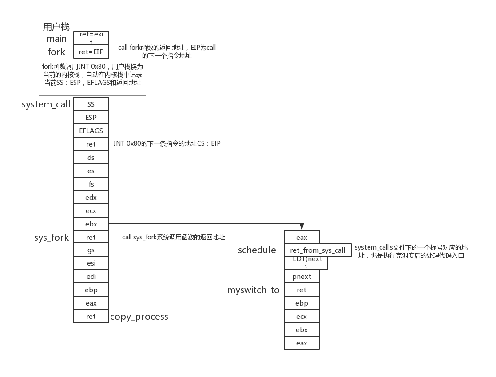
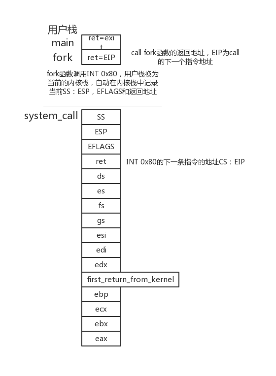

#基于内核栈切换的进程切换

##举例从main函数中的fork说起
main函数调用fork函数,以及发生调度时的栈结构。  
    

 fork后切换到子进程的栈结构  
   

##具体切换的改动过程
-  1、之前的任务切换方式是采用ljmp指令，完成基于TSS的任务切换。现在换成基于内核栈的切换方式。
即同一个CPU上的所有任务采用同一个TSS（0号进程的tss），TSS现在的作用只有在用户栈切入内核栈的时候有用在中断的时候，要找到内核栈位置，并将用户态下的SS:ESP，CS:EIP以及EFLAGS这五个寄存器压到内核栈中，这是沟通用户栈（用户态）和内核栈（内核态）的关键桥梁，而找到内核栈位置就依靠TR指向的当前TSS。  
具体代码更改 在kernel/sched.c的60行添加了`struct tss_struct *tss = &(init_task.task.tss);`声明一个指针指向0号进程的tss。所有的进程都共用0号tss  
    
    
 -  2、在`kernal/system_call.s`中添加一个汇编函数`myswitch_to`，在前面要用.global来对外声明， 在`kernal/sched.c`中`schedule`函数里调用`myswitch_to`。  
 1首先是切换PCB，将进程调度得到的`pnext`赋值给`current`。  
 2然后是TSS中的内核栈指针的重写，将`pnext+4096`赋值给`tss->esp0`。  
 3最后是切换内核栈，将`esp`寄存器的值保存到`pretask->kernal_stack_ptr`（上一个任务结构体）中，然后把`pnext->kernal_stack_ptr`赋值给`esp`。  
 4`myswitch_to`的两个参数`pnext`和`_LDT(next)`，其中`next`是待切换任务对应的`task`数组索引号，`_LDT(next)`就是待切换任务对应的局部描述符表的选择子，`pnext`是对应的`task_struct`的指针。所以pnext要初始化为`&(init_task.task)`，即0号进程的task_struct的地址。
   
   
 - 3、其中2里面的`kernal_stack_ptr`是之前没有的，自己更改`include/linux/sched.h`中`task_struct `结构体在第4个加一个`long kernal_stack_ptr`。还有INIT_TASK也得按照改后的格式更改,要在第4个位置添加一个0号进程的栈顶位置,其实这里给0也可以,在0号进程第一次调度的时候会自动将当前栈顶位置保存到这,且0号进程第一次启动时不需要这里的数据。  
     
     
 - 4、由于进程切换方式改变，那么对应的进程创建方式也得改变，和切换方式进行配合。路径`kernel/fork.c`
 1首先定义一个指针变量`kernelstack`指向` (long*)((long)p+PAGE_SIZE)`位置，即要创建的进程的栈底位置。  (85行)
 2然后把栈做成自己想要的样子。其中在栈的第一个函数返回处设置` (long)first_return_from_kernel`让第一次切换到该进程后的第一个返回就是跳转到`first_return_from_kernel`这个函数，在这个函数里再根据之前做好的栈进行pop就可以了，栈的最后5个寄存器值用来iret，且第一个也就是`eax`要`pop 0`---这就是fork子进程的返回值为0的原因。最后要把当前的栈位置赋值给`p->kernel_stack_ptr`(97-114行)
 
 
